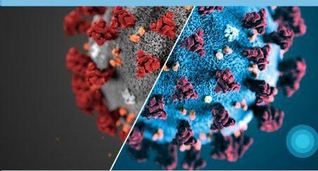
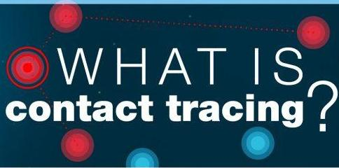
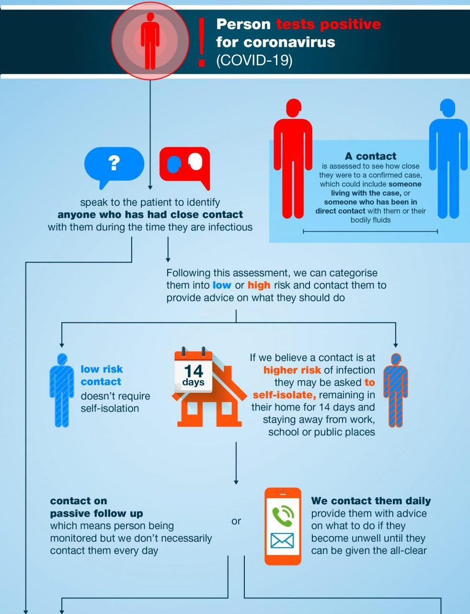
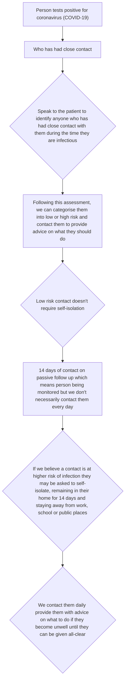
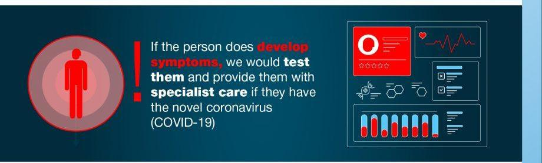
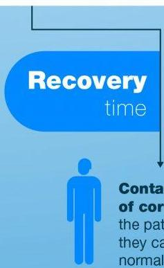
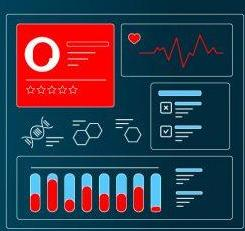
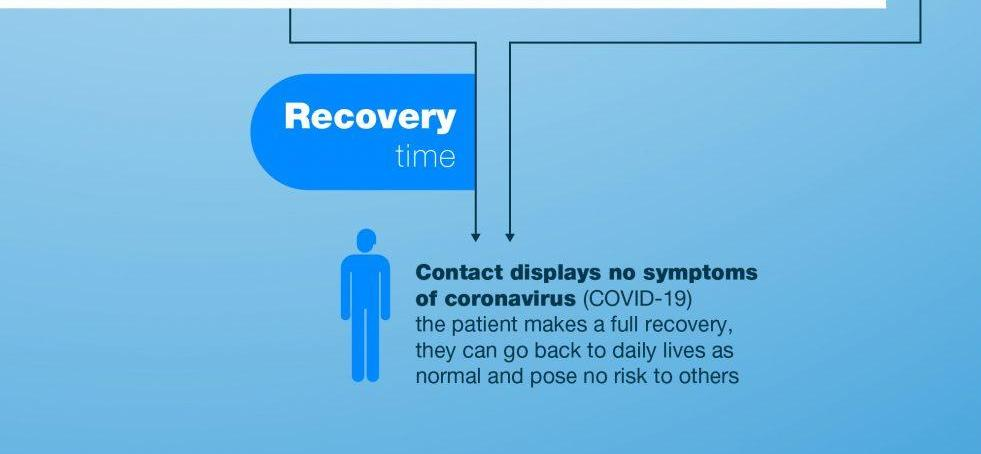

natural_image

Microscopic view of a biological structure with red and blue components, no visible text or symbols

text_image

WHAT IS
contact tracing?

Contact tracing is a fundamental part of outbreak control that's used by public health professionals around the world to prevent the spread of infections

flowchart

text_image

If the person does develop symptoms, we would test them and provide them with specialist care if they have the novel coronavirus (COVID-19)

text_image

Recovery
time
Conta
of con
the pat
they ca
normal

text_image

Infographic with scientific icons and charts, including a red 'O', EKG line, and bar graphs

text_image

Recovery
time
Contact displays no symptoms
of coronavirus (COVID-19)
the patient makes a full recovery,
they can go back to daily lives as
normal and pose no risk to others

